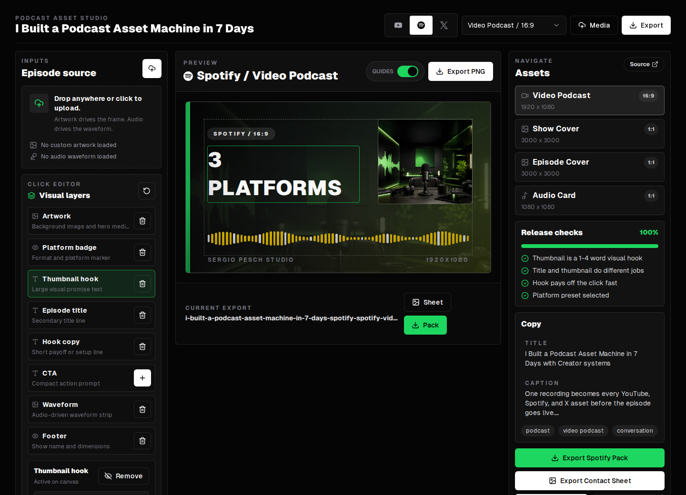

# Podcast Asset Studio

A one-page production workspace for creating podcast and video launch assets across three creator platforms: YouTube, Spotify, and X.



## Product

Podcast Asset Studio turns one episode idea into a platform-ready visual pack. It combines a compact platform switcher, asset format selector, creative direction presets, editable visual layers, waveform styling, generated copy, and export checks in a single browser workspace.

The product intentionally supports only YouTube, Spotify, and X. TikTok and other platforms are out of scope.

## Features

- Platform-aware asset packs for YouTube, Spotify, and X.
- Minimal platform navigation with real logo marks from `simple-icons`.
- Fast asset switching from the main workspace bar.
- Bundled AI-generated thumbnail backgrounds for each supported platform.
- Browser-based PNG export for individual assets.
- Platform pack export for all assets in the selected platform.
- Contact sheet export for reviewing a full platform pack before download.
- Generated title, caption, hashtags, and JSON production brief.
- Drag-and-drop local artwork and audio uploads.
- Audio waveform fallback and decoded waveform rendering when source audio is available.
- Creative direction presets for common packaging approaches.
- Click-to-select visual layer editor for artwork, badges, headline text, hook copy, CTA, waveform, and footer elements.
- One-click add/remove controls for waveform and other composition elements, reflected in preview, exports, contact sheets, and production briefs.
- Release checks for thumbnail length, title/caption fit, platform selection, artwork, and waveform readiness.

## Platform Packs

| Platform | Assets |
| --- | --- |
| YouTube | Episode Master, Shorts Frame, Thumbnail, Podcast Playlist Art |
| Spotify | Video Podcast, Show Cover, Episode Cover, Audio Card |
| X | Vertical Video, Timeline Square, Launch Card, Quote Card |

Spec notes in the UI were verified on April 28, 2026 using official platform documentation.

## Tech Stack

- Next.js 16
- React 19
- Tailwind CSS 4
- Radix UI primitives
- lucide-react
- simple-icons
- Playwright
- sharp

## Getting Started

```bash
npm install
npm run dev
```

Open [http://localhost:3000](http://localhost:3000).

## Validation

Run the standard local checks:

```bash
npm audit --audit-level=moderate
npm run lint
npm run build
```

Run the browser export QA sweep against a production server:

```bash
PORT=3002 npm run start
EXPORT_QA_URL=http://localhost:3002 npm run qa:exports
```

`npm run qa:exports` downloads and verifies 15 generated PNGs: 12 platform assets plus one contact sheet for YouTube, Spotify, and X. It checks dimensions, file size, nonblank pixel range, and verifies that unsupported platform copy is not rendered.

## CI

GitHub Actions runs the same release gate on pull requests and pushes to `main`:

- `npm ci`
- Chromium install for Playwright export QA
- `npm audit --audit-level=moderate`
- `npm run lint`
- `npm run build`
- `npm run qa:exports`
